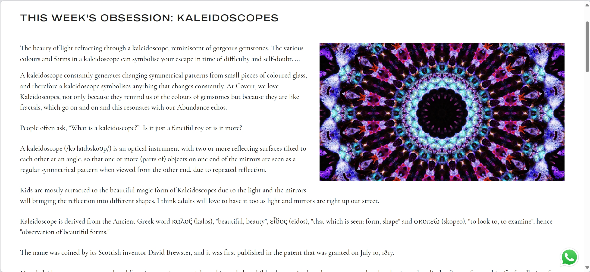
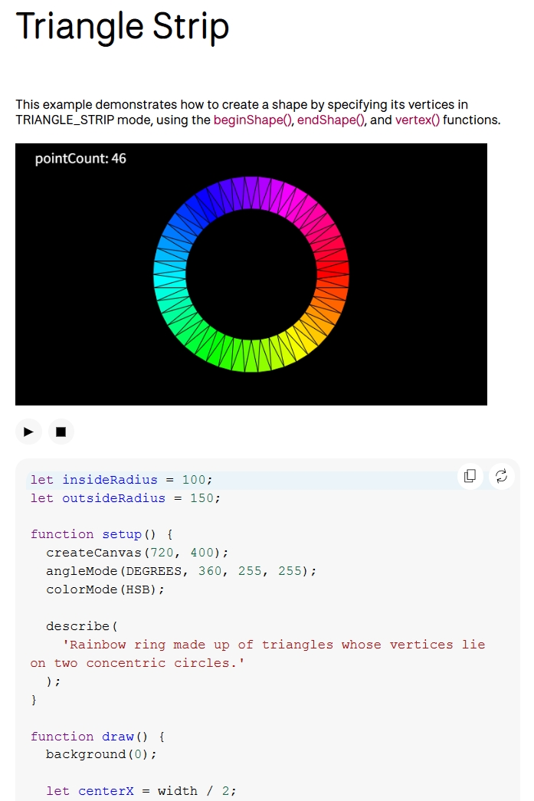

# yliu0935_9103_tut03 (Includes quiz 9 and final assignment)

## Individual Functioning Prototype for the Final Assignment (Final submissions)
### Animation Interaction Description
The animation runs automatically upon loading, requiring no clicking or mouse movement. Viewers are invited to observe the evolving visual effects: Dot Rings (the small dots surrounding each circle) radiate inward with gradual color transitions, creating a pulsing effect. The Chain Links connecting different parts of the structure shimmer with flowing rainbow-like gradients. Pink Curves sway gracefully as if dancing in the wind, while the Spoke Rings slowly expand and contract, echoing the rhythm of a heartbeat.
All animations are seamlessly driven by smoothly evolving Perlin noise, creating a continuous, organic visual rhythm.

### Details of my individual approach to animating the group code
- **I chose to drive my individual code using Perlin Noise.**

- **I created four distinct and logically independent animation modules, all driven by Perlin noise.**

 - DotRing (Color Radiance) - Perlin noise is used to continuously modulate the RGB values of each dot, creating smooth, inward-radiating color transitions.
 - ChainLink (Color Gradient) - Each chain link cycles through hues using HSB color space mapped to Perlin noise, producing a seamless and fluid rainbow gradient animation.
 - PinkCurve (Swaying Motion) - The control points of the curves are subtly adjusted by Perlin noise, generating soft, wave-like movements in the wind.
 - SpokeRing (Breathing Animation) - The inner and outer radii of each spoke change gradually based on Perlin noise, simulating an effect as the rings rhythmically expand and contract.
 - DotRing (Size Changes) - Each dot's radius fluctuates over time using Perlin noise, enhancing the pulsing sensation with a rhythmic breathing-like motion.

By relying entirely on Perlin noise rather than user input or timers, I focused on generating visual motion that felt natural and continuous. This was something that made me different from my team members.

- **References to inspiration for animation**
####

####
This aesthetically pleasing GIF reminded me of our PinkCurve, which could also achieve a similar swaying motion by adjusting the positions of its control points.
####

####
This GIF inspired me to explore rhythmic and pulsating size variations for the DotRing, using Perlin noise to create smooth, flowing animations with a sense of rhythm and harmony.
####

####
This GIF made me think that the colors in our group’s Chain component could also transition like this, with a rainbow-like gradient. Similarly, the DotRing could achieve a comparable effect using Perlin noise.

- **Technical explanation of my individual code**
To animate each visual module, I declared five global Perlin noise offsets (dotRingNoiseOffset, chainNoiseOffset, pinkCurveNoiseOffset, spokeNoiseOffset, dotRingSizeNoiseOffset) and updated them continuously in the *draw()* loop. 

 - DotRing (Color Radiance) - I use Perlin *noise()* with global (*dotRingNoiseOffset*) and radial inputs to dynamically modulate each dot's RGB color values. I then *map()* the noise to precise color shifts, applying them to individual RGB channels extracted via *red()*, *green()*, *blue()*. *constrain()* ensures valid *[0, 255]* color ranges, creating smooth, inwardly radiating color pulses.

 - ChainLink (Color Gradient) - I achieve this animation by setting *colorMode(HSB, 360, 100, 100)*, which allows me to control Hue, Saturation, and Brightness independently. I use *noise()* (combining *chainNoiseOffset* and *i * 0.1* for spatial-temporal variation) to generate dynamic HSB values for each segment. I then *map()* these noise outputs to specific HSB ranges.

 - PinkCurve (Swaying Motion) - I drive the swaying motion by using *noise()* (*pinkCurveNoiseOffset + i * 0.1*), which modulates the vertical *ctrlY* position of each curve's middle control point. I *map()* the noise to a dynamicOffset.

 - SpokeRing (Breathing Animation) - I use *noise()* (*spokeNoiseOffset + ang * 0.5*) to dynamically adjust the innerR and outerR of the spokes. I *map()* these radii within defined percentage ranges, producing rhythmic expansion and contraction.

 - DotRing (Size Changes) - I scale dot diameter dynamically using *noise()*, *map()* ping its output to a range of 50% to 150% of the original diameter. Crucially, to prevent spacing distortion when sizes change, I pre-calculate the number of dots per ring (*this.fixedNumDotsPerRow*) in the constructor using floor(*(TWO_PI * radius) / (originalDiameter * 1.6)*), ensuring stable and evenly spaced dot positions.

- **Explanation of changes made to group code**
Compared to the original group code in sketch.js, I made two structural changes to enhance animation stability and visual coherence. First, in the *DotRing* component, the number of dots per ring was originally recalculated dynamically based on radius and dot size, which caused layout instability when dot diameters changed. In my version, I fixed the number of dots per row at initialization using *floor((2π * radius) / (dot size × constant))*, ensuring spatial consistency even when size animates.

Second, the original *ChainLink* used *random()* for color assignment. Once *noLoop()* was removed to allow animation, this caused rapid flickering. I replaced the color logic with *colorMode(HSB)* and mapped hue, saturation, and brightness to Perlin noise values, producing smooth, flowing gradient transitions.

Aside from these changes, all other components retain the original structural logic from the group code but are enhanced with Perlin noise–driven animations to bring them to life.

- **External tools or techniques used**
I utilized the *Set* data structure within the *PinkCurve* class to manage specific states of the curves.
 - I created a Set instance: *downSet = new Set()*.
 - Within the PinkCurve's update logic, I added instances to this set using *downSet.add(this)* when a curve needed to move downwards.
 - Reference:[Set](https://p5js.org/reference/p5/set/)

I utilized the *quadraticVertex()* function within the PinkCurve class to draw dynamic organic curves.
 - I employed the *quadraticVertex()* function in the beginShape() and endShape() block: *quadraticVertex(this.ctrlX, this.ctrlY, this.p2.x, this.p2.y);*.
 - I applied *noise (noise(pinkCurveNoiseOffset + i * 0.1))* to the *ctrlY* (the control point's y-coordinate) to make the curve exhibit organic and dynamic oscillating movements.
Reference: [quadraticVertex](https://p5js.org/reference/p5/quadraticVertex/)

---

## Quiz 9 (Previous submissions)
### Part 1: Imaging Technique Inspiration
We chose Wheels of Fortune by Pacita Abad. This work uses repeated concentric circles and dotted textures to create a strong rhythm and dynamics, which gave us a good design inspiration. One of my inspirations came from the kaleidoscope I played with when I was a child, which uses the mirror principle to change a part of the image to present a rich changing effect. Another is the striped texture that often appears in science fiction movies, which creates a deep science fiction feeling through dense lines.

### Part 2: Coding Technique Exploration
By treating the artwork as a texture and drawing a ring of triangular slices whose number and radii respond to user input, one can reveal segments of the image in a rhythmic, kaleidoscopic way. Sampling pixel colors for each slice ensures the triangles reflect the original painting, while smoothly interpolating between inner and outer boundaries creates pulsing motion. Mapping interactive control to pointer movement adjusts segment density in real-time. This technology can be used to achieve interesting interactions and rich visual experiences.

Reference example:[Triangle Strip](https://p5js.org/examples/angles-and-motion-triangle-strip/)

